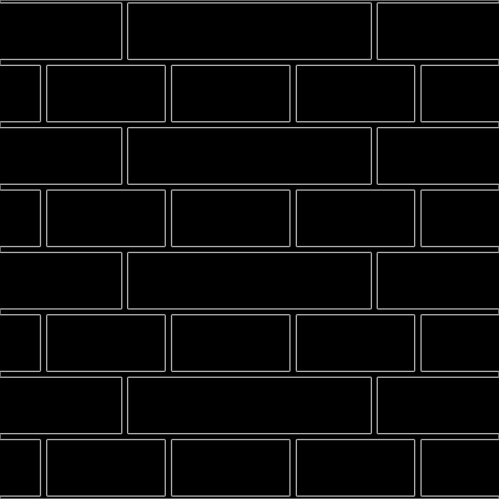
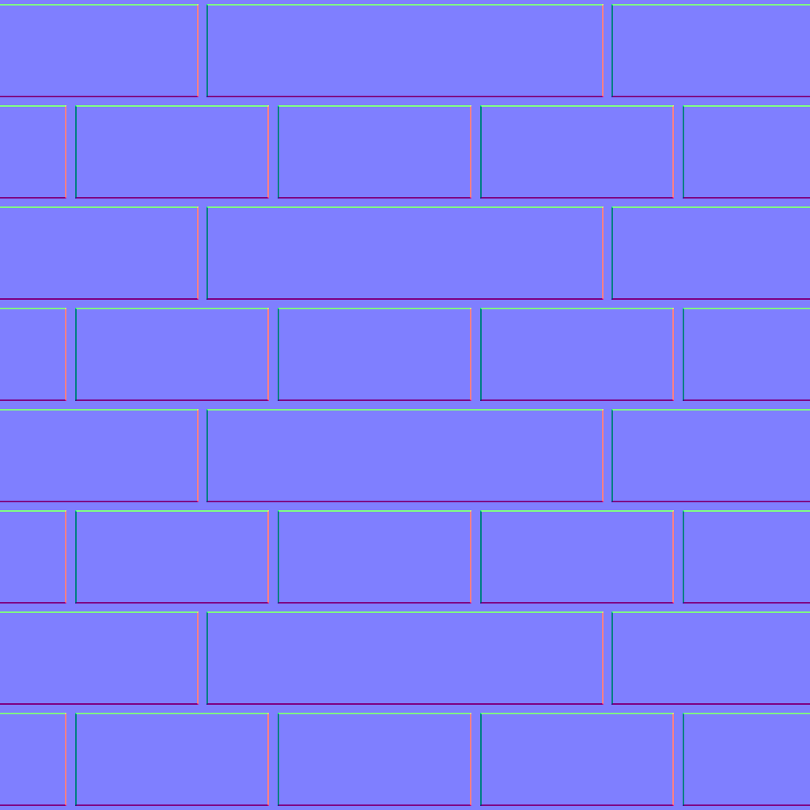
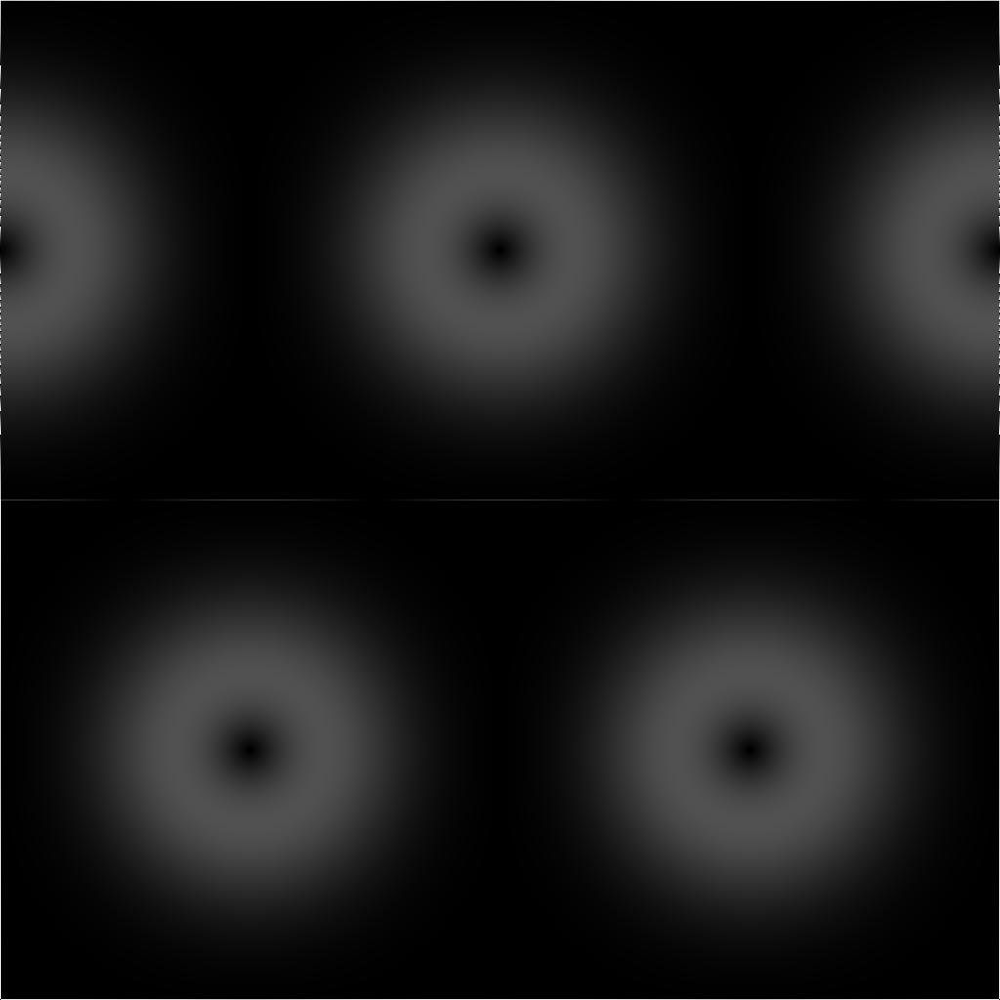
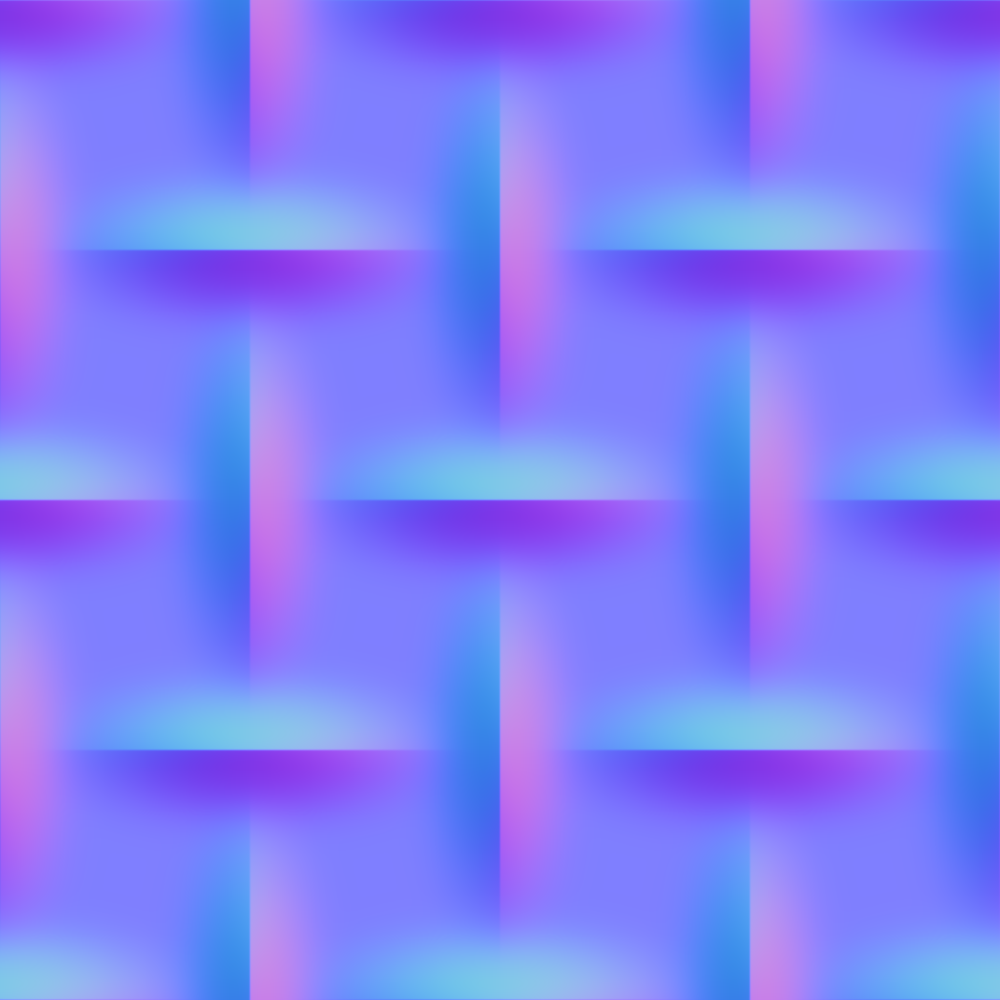
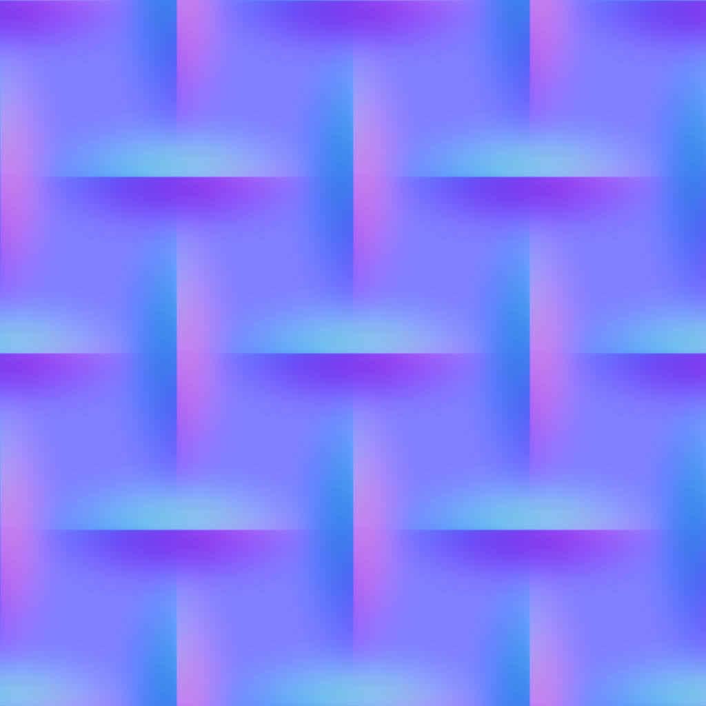
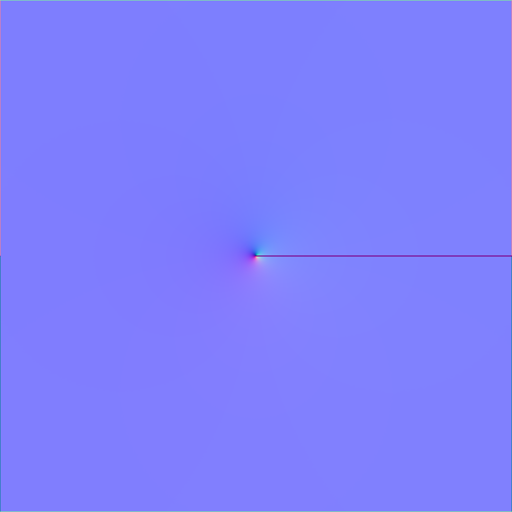
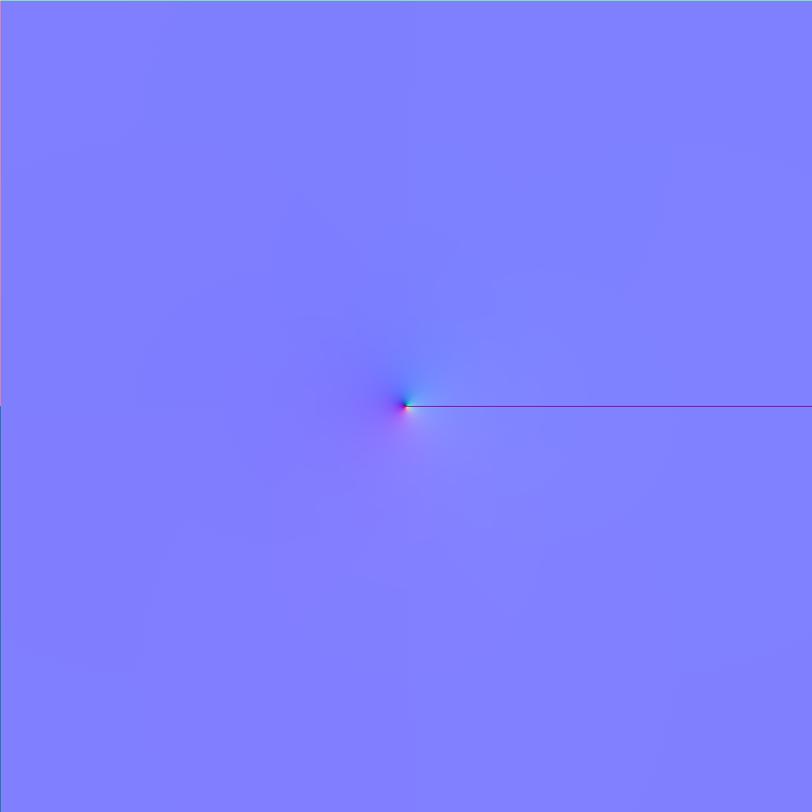

# height2normal
Differentiable height map to normal map conversion, using PyTorch

## Environment setup
Please update your environment using the updated `environment.yaml` file.

- [Miniconda](https://docs.conda.io/projects/miniconda/en/latest/), for environment management.

    ```
    conda env create -f environment.yaml
    conda activate h2n

    pip install torch torchvision --index-url https://download.pytorch.org/whl/cu121
    pip install -r requirements.txt
    ```
- [Demo](demo.ipynb)

## Results


| Name   | ··Height··  | Gradient·  |  ··Normal··  | Substance |
|  :---: | :---:   | :---:     | :---:    | :---:     |
|brick   |   |   |      |     |
|gaussian|||   |  |
|polygon | | |    |   |
|mesh    |    |    |       |      |
|gradient|||   |  |